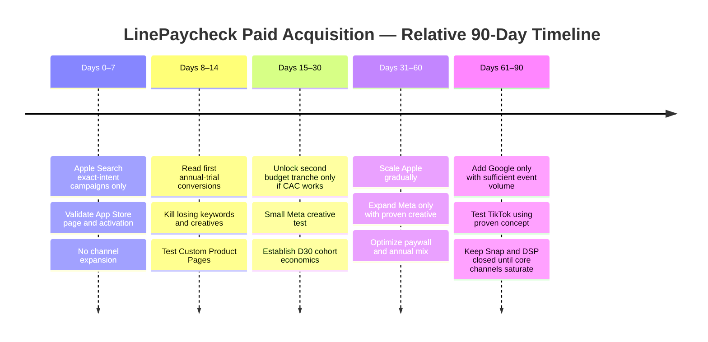

# LinePaycheck Paid Acquisition Strategy for Month-One Profitability

## Executive summary

**The central conclusion is uncomfortable but useful: LinePaycheck should not launch by spreading money across six ad networks.** A brand-new $9.99/month or $79.99/year iOS subscription app has a plausible path to **paid-acquisition contribution profitability in its first month**, but only if it behaves more like a high-intent search utility than a conventional consumer subscription app.

The primary channel should therefore be **Apple Ads Advanced, Search Results only**, concentrated on exact/high-intent terms such as *overtime calculator*, *work hours pay calculator*, *pay tracker*, *callout pay*, *double time calculator*, and ultimately lineworker-specific terms where the product truthfully supports the underlying pay rules. Apple Ads Search Results traffic has unusually high tap-to-install conversion: SplitMetrics reported 67.2% average conversion for 2024 and 66.2% for 2025, although Finance traffic is substantially more expensive than Business/Productivity traffic. citeturn20search6turn20search2

The strongest warning is the post-install funnel. RevenueCat's 2026 subscription-app dataset puts median North American download-to-paid conversion by day 35 at only **2.6%**, while the 90th percentile reaches **10.4%**. citeturn14search0 With LinePaycheck's proposed pricing and a 65% annual-plan mix, I estimate about **$44.81 of risk-adjusted first-purchase proceeds per new payer** if StreamEntry qualifies for Apple's Small Business Program. At the median 2.6% download-to-paid rate, the break-even CPI is only **$1.17**—too low for a serious U.S. iOS niche campaign. At an 8% paid conversion rate, however, break-even CPI rises to **$3.58**. Apple's Small Business Program reduces commission to 15% for qualifying developers; otherwise the first-year economics are materially worse. citeturn9search0turn9search1

That means **month-one profitability requires LinePaycheck to perform much closer to the upper end of subscription-app conversion than to the median**. This should be treated as a falsifiable operating requirement, not assumed into the spreadsheet.

My recommended definition of “month-one profitability” is:

> **D30 paid-acquisition contribution profit:** risk-adjusted App Store proceeds generated within 30 days by a paid cohort exceed the advertising spend that acquired that cohort.

This is *not* the same as total company profitability, and it is not the same as bank-cash profitability because App Store settlement timing differs from economic recognition.

### Recommended launch assumptions

| Variable | Base assumption | Why |
|---|---:|---|
| Launch geography | United States only | Highest product-market relevance for initial lineman positioning; avoids mixing purchasing-power and payroll-rule contexts |
| Initial media cap | **$4,000** | Enough to discover whether the funnel is economically viable without buying an expensive lesson |
| Annual product | `linepay.pro.yearly` — **$79.99/year** | Annual upfront revenue is critical to month-one payback |
| Monthly product | `linepay.pro.monthly` — **$9.99/month** | Lower-commitment alternative |
| Subscription group | `LinePaycheck Pro` | Given product configuration |
| Annual mix target | **≥65% of new payers** | Assumption; materially improves first-month economics |
| Annual trial | **7 days** | Assumption and deliberate payback/conversion compromise |
| Monthly trial | **None initially** | Allows a lower-commitment immediate-purchase route |
| Install → annual trial | ~12.2% target | Modeling assumption |
| Annual trial → paid | ~42.5% target | Stretch assumption, not a seven-day benchmark. RevenueCat 2026 reports 37.4% median for 5–9-day trials; compare matched cohorts and actual proceeds. [Source](https://www.revenuecat.com/state-of-subscription-apps) |
| Direct monthly purchase | ~2.8% of installs | Modeling assumption |
| Total install → paid | **8% target** | Above market median; required by economics |
| Small Business commission | 15% | Assumes StreamEntry qualifies and enrolls citeturn9search0turn9search1 |
| Refund/tax/payment-risk reserve | 5% | Conservative modeling assumption, not an Apple benchmark |

**Do not interpret the 8% install-to-paid figure as a forecast.** It is the target the product must prove. RevenueCat's North American median of 2.6% and 90th percentile of 10.4% show how demanding that target is. citeturn14search0

The month-one strategy I would actually fund is:

**First $2,000:** 100% Apple Ads Advanced Search Results.

**Second $2,000:** unlocked only if the first cohorts demonstrate approximately CPI ≤ $2.75, payer CAC trending below $40, annual mix ≥60%, and projected D30 net ROAS ≥1.15. Of this second tranche, roughly $1,500 remains in Apple Ads and at most $500 tests Meta.

**Google App Campaigns, TikTok, Snapchat, programmatic DSPs, and Apple Ads Basic receive $0 initially.** They are not bad channels; they are premature channels. Google's own guidance recommends daily budgets around 50× target CPI for install optimization and roughly 10× target CPA or more for action optimization, which is incompatible with a tiny experimental allocation. citeturn15search14turn15search18

The strategic thesis is therefore:

> **Search captures existing pain. Social must manufacture the pain in the viewer's mind. A month-one-profitability constraint strongly favors capturing intent before manufacturing it.**

## Market benchmarks and unit economics

Apple Ads is unusually attractive because Search Results appear at the moment a user is explicitly looking for an app. Advanced campaigns support Search Results keywords, max-CPT bidding, target-CPA controls for Search Results, budgets and audience configuration; Basic uses an automated maximum-CPI model. citeturn0search4turn0search8

Published Apple benchmarks are considerably better grounded than comparable public iOS figures for Meta, TikTok, Snapchat and programmatic DSPs. SplitMetrics' 2025 dataset reported overall Search Results CR of **66.2%**, average CPT of **$2.25**, and acquisition cost of **$3.76**; Finance was much more expensive, with CPT around **$6.06** and acquisition cost around **$13.28**. citeturn20search2 AppTweak's large 2025 dataset similarly shows substantial category dispersion: U.S. median Search Results CPI around **$2.49 Business**, **$3.13 Productivity**, and **$8.44 Finance**, with corresponding median tap-to-install conversion around **57%, 56%, and 46%**. These are category benchmarks, not forecasts for LinePaycheck. citeturn0search3

The important implication is that **LinePaycheck should not mentally benchmark itself against crypto/banking Finance acquisition merely because it involves money**. Its behavioral category is closer to work tracking/productivity. The actual auction will be driven by the keywords being bought, but this category dispersion is evidence that intent matters enormously. citeturn20search18turn20search2

### Channel benchmark table

“CPA-paid” below means **modeled cost per new paying LinePaycheck subscriber**, using an 8% install-to-paid rate unless otherwise stated. It is not a network-published metric. Where current, trustworthy iOS-specific public data does not exist, I explicitly label the range as a planning estimate rather than laundering weak data into a “benchmark.”

| Channel | Published 2024–2026 evidence | CTR/TTR | Click/tap → install CR | U.S. iOS planning CPI | Modeled CPA-paid at 8% | Evidence confidence |
|---|---|---:|---:|---:|---:|---|
| **Apple Ads Advanced — Search Results** | 2024 CR 67.2%; 2025 overall CR 66.2%, CPT $2.25, acquisition $3.76. Finance much higher at CPT $6.06 / CPA $13.28. citeturn20search6turn20search2 | ~11.4% 2024 aggregate benchmark citeturn0search2 | ~50–67% typical; category dependent citeturn20search2turn0search7 | **$2.25–$3.50 target for LinePaycheck long-tail; $5–$9 possible on broad Finance terms** | $28–$44 target | **High** |
| **Apple Ads Basic** | Apple's buying unit is max CPI; there is no comparably robust public Basic-only CTR/CR benchmark. citeturn0search8 | Not useful for planning | Same App Store demand pool, but automated | **$2.50–$3.50 cap** if tested | $31–$44 | Medium-low |
| **Meta iOS app ads** | Meta's current Advantage+ app campaigns automate audience, bidding and placement across Meta inventory; Meta does not publish a current universal U.S.-iOS CPI/CTR benchmark. citeturn11search1turn11search7 | **~0.8–1.5% planning band**, not an authoritative platform benchmark | **~20–40% planning band** | **$3–$6** niche U.S. planning range; broad studies often put Meta around $2–$5.50 citeturn15search4 | $38–$75 | Low-medium |
| **Google App Campaigns / UAC** | Broad 2025–26 market summaries cluster Google App Campaign CPI around $1.50–$4.50; Google recommends tCPI or downstream-action bidding and substantial conversion volume. citeturn15search15turn15search14 | Not meaningfully comparable across Search/YouTube/Display inventory | Not meaningfully comparable | **$3–$6 for U.S. iOS niche planning** | $38–$75 | Medium on mechanics, low on niche CPI |
| **TikTok App Promotion** | TikTok officially recommends tracking CPI, install→conversion, ROAS, retention and LTV; broad third-party 2026 estimates cluster around $1.75–$4 CPI. citeturn15search9turn15search15 | Third-party estimates commonly ~0.6–1.8%; treat cautiously | Highly creative-dependent; no credible universal iOS benchmark | **$2–$5 experimental** | $25–$63 | Low-medium |
| **Snapchat** | Reliable public 2024–26 U.S. iOS niche CPI/CR evidence is thin; one large third-party campaign dataset reports App Install CPM around $23.40 and general CPC around $0.84, but this is insufficient to infer LinePaycheck CPI reliably. | Not robust enough | Not robust enough | **$3–$7 experimental planning band** | $38–$88 | **Low** |
| **Programmatic mobile DSPs** | Liftoff cites in-app CTR around **0.56%**, compared with ~0.23% mobile web, and North American in-app eCPM around **$6.50** in its referenced market data. CPI varies materially by inventory and optimization signal. citeturn1search10 | ~0.56% in-app | Highly variable | **$3–$8+** | $38–$100+ | Medium for inventory metrics, low for LinePaycheck CPI |

For context, broad 2025 market summaries put global iOS CPI around **$1.50–$3.50**, but a niche U.S. worker-finance utility should not plan from that global average. citeturn15search0 Adjust's 2025 finance-app data showed global category CPI declining to roughly $1.13 in H1 2025, again illustrating how geography and category aggregation can produce figures that are useless as U.S. acquisition targets. citeturn2search5

### The month-one economic constraint

Assuming Small Business Program economics:

\[
Monthly\ proceeds = \$9.99 \times 85\% = \$8.49
\]

\[
Annual\ proceeds = \$79.99 \times 85\% = \$67.99
\]

After a deliberately conservative 5% reserve for refunds/payment/tax leakage in the acquisition model:

\[
Monthly = \$8.07
\]

\[
Annual = \$64.59
\]

At a **65% annual / 35% monthly** first-purchase mix:

\[
Expected\ first\ receipt =
0.65(\$64.59)+0.35(\$8.07)
=\mathbf{\$44.81}
\]

Apple's Small Business Program is therefore a meaningful acquisition variable, not an accounting footnote. Without it, first-year subscription proceeds generally use the standard 70% developer share before the one-year subscriber threshold; Small Business participants receive 85% from the beginning. citeturn9search0turn9search1

| Annual share | Risk-adjusted first receipt / payer | Break-even CPI at 8% paid conversion |
|---:|---:|---:|
| 30% | $25.02 | $2.00 |
| 50% | $36.33 | $2.91 |
| **65% base** | **$44.81** | **$3.58** |
| 80% | $53.29 | $4.26 |

This is why I recommend the annual plan rather than a “monthly first” paywall. Annual is not merely an LTV optimization; it fundamentally changes the month-one acquisition envelope.

### Funnel and profitability scenarios

RevenueCat reported an average trial-to-paid rate around 37–38% in 2024, while longer trials generally converted better; its 2026 analysis reported approximately **42.5% for 17+ day trials versus 25.5% for shorter cohorts**. Seven-day trials have historically shown higher very-early cancellation behavior than longer ones. citeturn14search16turn14search6turn14search3

I nevertheless recommend a **7-day annual trial initially**, because LinePaycheck should demonstrate value much faster than a habit-building app and the business is intentionally optimizing for early payback. This is an assumption to test, not a claim that seven days is universally optimal.

**September 5 reconciliation:** [onboarding.md](onboarding.md) now owns the first-work proof → annual trial offer → seven-day activation sequence, eligibility states, and exact funnel denominators. [pricing.md](pricing.md) confirms Annual trial / Monthly immediate paid; [the setup record](research/onboarding-trial-2026-09-05.md) records actual App Store state. Funnel targets below are model inputs, not results. Do not attribute aggregated ratios to linked install cohorts when Apple reporting cannot establish that linkage.

Base modeled funnel:

```text
100 paid installs
      │
      ├── ~12.2 annual trials
      │        ↓ 42.5% trial→paid target
      │      ~5.2 annual payers
      │
      └── ~2.8 direct monthly payers
               ↓
        ~8 total payers
```

This puts the paid mix around 65% annual / 35% monthly.

| Scenario | Install → paid | CPI | Payer CAC | First-receipt proceeds | D30 acquisition ROAS | Interpretation |
|---|---:|---:|---:|---:|---:|---|
| RevenueCat NA median-like | 2.6% | $2.50 | $96.15 | $44.81 | 0.47× | **Economically impossible** |
| Minimum viable funnel | 6.5% | $2.50 | $38.46 | $44.81 | 1.17× | Thin; no room for surprises |
| **Launch target** | **8.0%** | **$2.50** | **$31.25** | **$44.81** | **1.43×** | Attractive enough to scale carefully |
| Near RevenueCat NA 90th percentile | 10.4% | $2.50 | $24.04 | $44.81 | 1.86× | Excellent |
| Base funnel but CPI $3.50 | 8.0% | $3.50 | $43.75 | $44.81 | 1.02× | Essentially break-even |

RevenueCat's 2.6% North American median and 10.4% 90th percentile provide the base-rate reality behind those scenarios. citeturn14search0

**Therefore the real launch KPI is not CPI. It is `CPI / D30-paid-conversion`, i.e. payer CAC.**

### Retention and LTV assumptions

For long-term planning, RevenueCat reports approximately **56% first-renewal rate for monthly subscriptions**, around **27% first annual renewal**, and long-term median retention around 11% for monthly and 28% for annual subscriptions in its broader benchmark set. citeturn14search12

I model 24-month net LTV conservatively as follows:

- Annual: initial year plus one renewal at a 27% probability.
- Monthly: approximately 4.64 expected payments over 24 months, using a retention curve calibrated to the published first-renewal and 12-month figures.
- 65% annual payer mix.
- 5% proceeds reserve maintained.

That yields an estimated **24-month risk-adjusted LTV of ~$66.42 per payer**. This is a modeling estimate, not a RevenueCat benchmark.

Crucially, **do not use the $66 LTV to excuse a $50 month-one CAC**. The user's explicit objective is month-one profitability, so the acquisition system should be managed against the ~$44.81 first-purchase envelope.

### Required sensitivity analysis

For “retention ±20%,” applying ±20 percentage points to a probability would produce nonsensical values in some cases. I therefore interpret the requested sensitivity as **realized lifetime receipts ±20%**, which is economically equivalent and mathematically valid.

| Sensitivity case | CPI | Install → paid | Payer CAC | Month-one first-receipt ROAS | Modeled 24m LTV | LTV/CAC |
|---|---:|---:|---:|---:|---:|---:|
| **Downside: CPI +20%, CR −20%, retention/LTV −20%** | $3.00 | 6.4% | $46.88 | **0.96×** | $53.14 | 1.13× |
| **Base** | $2.50 | 8.0% | $31.25 | **1.43×** | $66.42 | 2.13× |
| **Upside: CPI −20%, CR +20%, retention/LTV +20%** | $2.00 | 9.6% | $20.83 | **2.15×** | $79.71 | 3.83× |

The downside scenario is important: a merely **20% deterioration in CPI plus 20% deterioration in conversion destroys month-one profitability**. This business cannot initially tolerate lazy channel expansion.

## Competitive creative audit and positioning

The five most useful reference competitors are not necessarily five direct substitutes. There is not yet an obvious mainstream app centered specifically on **worker-side reconciliation of complex lineworker compensation rules against actual paid amounts**. Instead, LinePaycheck sits between worker time trackers, shift/pay calculators, employer field-time systems, and payroll apps.

The current competitive landscape makes the white space unusually clear: Workyard and Timeero are fundamentally employer/control products; QuickBooks Workforce is attached to an employer payroll ecosystem; HoursTracker is a generalized self-tracking utility; My Shift Planner is primarily a scheduling product with earnings features. Their public product descriptions support those positioning differences. citeturn16search1turn16search2turn16search3turn16search4turn16search30

iturn17image3turn17image4turn18image2turn17image0

From left to right, the examples above show Workyard's compliance/time-card presentation, Timeero's GPS/job-management emphasis, HoursTracker's dense earnings/time summary, and My Shift Planner's calendar-first visual model. citeturn16search1turn16search2turn16search30turn16search4

QuickBooks Workforce follows a similar functional approach, using large direct headlines around clock-in/time/pay functionality rather than a distinctive worker-side reconciliation metaphor. Its App Store listing explicitly combines pay information and time tracking because it is tied to QuickBooks Payroll/Time customers. citeturn16search3


| Competitor | Public creative/copy example | Creative pattern | What works | LinePaycheck opportunity |
|---|---|---|---|---|
| **Workyard** | Public Facebook creative: “Workyard replaces your construction time clock with GPS-verified hours that capture automatically.” citeturn19search0 | Navy trade aesthetic, construction context, phone UI, GPS proof | Specific to field work; tangible problem | It speaks primarily to the **employer paying labor**, not the worker verifying pay |
| **Timeero** | Public social copy emphasizes eliminating missed punches and incomplete mileage logs to simplify payroll. citeturn19search1 | White/orange, maps, GPS, geofence, managerial UI | Clear operational value | Again, the hero is management efficiency rather than the worker's paycheck |
| **HoursTracker** | Store positioning emphasizes quick time entry and tracking pay, tips, mileage and overtime. citeturn19search9 | Bright blue, utilitarian iOS UI, dense numbers | Strong utility credibility | Generic time tracker; little emotional ownership around **“Did I get paid right?”** |
| **QuickBooks Workforce** | “lets teams view pay info and track time in one place.” citeturn16search3 | Corporate gray/green, ecosystem trust, large text | Familiar payroll brand and broad capability | Requires employer ecosystem; LinePaycheck can be independent, personal and private |
| **My Shift Planner** | “Stay on top of your rota. Track shifts; Calculate pay; Share your calendar…” citeturn19search3 | Bright multi-color calendar blocks | Clearly worker-oriented | Schedule is the primary object; pay verification remains secondary |

A public Workyard Facebook ad and Timeero Facebook presence were readily indexable. For HoursTracker, QuickBooks Workforce and My Shift Planner, current public paid-ad library assets were not reliably retrievable, so I have used current App Store/owned-channel copy rather than pretending that product-page copy is a paid ad.

The strongest strategic white space is:

> **Other apps record time for payroll. LinePaycheck keeps a worker's independent ledger of what the work should have paid.**

That should dictate both product and creative.

Avoid positioning LinePaycheck as:

> “another time clock.”

Position it as:

> **the worker's private pay ledger.**

And avoid inflammatory language such as “your employer stole $287.” LinePaycheck's calculation may depend on user-entered rules or incomplete evidence. “Possible shortfall,” “expected pay,” “check the difference,” and “verify the math” are more truthful and more credible.

## App Store conversion and creative system

The App Store page is part of the advertising funnel, not post-ad decoration. Apple supports Product Page Optimization tests against the default page and Custom Product Pages for specific campaigns and intents; CPPs can vary screenshots, previews and promotional messaging, and Apple currently supports up to 70 custom pages. citeturn8search2turn8search6 Apple says campaigns routed to a relevant Custom Product Page have produced an average conversion lift of about **2.5 percentage points** in its published benchmark, though individual results vary materially. citeturn10search5

LinePaycheck should therefore build the paid funnel as:

```text
keyword / creative
        ↓
matching Custom Product Page
        ↓
matching first-use promise
        ↓
first expected-pay result
        ↓
contextual paywall
```

not:

```text
every ad
   ↓
same generic App Store page
   ↓
generic onboarding
   ↓
subscription screen
```

### Recommended App Store positioning

**App name:** `LinePaycheck`

**Suggested subtitle:**  
`Hours, Overtime & Pay`

The first five screenshot messages should be outcome-first:

| Screenshot | Headline | Visual |
|---|---|---|
| Hero | **Know what your work should pay.** | Large expected-pay figure; Line Gap motif |
| Work logging | **Log the shift. Keep your own record.** | Real shift timeline |
| Rule math | **See exactly how every hour was calculated.** | Regular / OT / double-time ledger rows |
| Reconciliation | **Expected → Paid → Possible shortfall** | Pay Ledger comparison |
| Trust | **Your wage data stays on your iPhone.** | Quiet privacy/local-device diagram, only while factually true |

For lineworker-specific CPPs, once the corresponding domain logic is actually shipped:

**Storm / long-shift page**
> What should this 16-hour shift pay?

**Callout page**
> Callout minimum. Overtime. Double time. See the math.

**Paycheck-audit page**
> Check the paycheck line by line.

Apple Ads Search Results can associate campaign intent with Custom Product Pages, allowing the search term and page creative to reinforce one another. citeturn0search20turn8search21

### ASO keyword architecture

Start with the problem language, not internal product terminology:

```text
Core money intent
pay tracker
wage tracker
paycheck calculator
earnings tracker
pay calculator

Hours + pay
work hours pay
hours calculator
time card
work hours tracker
shift pay

Premium-pay intent
overtime calculator
double time calculator
callout pay
per diem tracker

Trade wedge — only when truthfully supported
lineman pay
lineworker overtime
storm work pay
callout minimum
```

A particularly important negative-keyword cluster for paid search is:

```text
payday loan
paycheck advance
cash advance
early wage access
tax calculator
payroll software
payroll processing
paystub generator
salary calculator
employer payroll
```

The word *paycheck* lives next to some extremely expensive and completely wrong financial intent. Broad “paycheck” bidding without negatives could burn budget rapidly.

I would also strongly consider **Productivity as the primary App Store category and Finance as secondary**, if App Review and the final feature set make that categorization accurate. That is not an attempt to game the auction; it better describes an independent work/pay-record utility than banking, investing or lending. The paid-category benchmark difference is nevertheless notable: current Apple Ads data shows Finance acquisition far more expensive than Business/Productivity. citeturn20search2turn0search3

### Creative doctrine: Precision Industrial Minimalism

The advertising should extend LinePaycheck's existing **Oxide teal / graphite / porcelain / copper** system rather than adopt “performance marketing aesthetics.”

No:

- fake AI lineman hero
- blue-purple gradients
- glowing phones
- lightning-bolt clichés
- pseudo-cinematic substations
- neon dashboards
- AI avatars explaining wages
- fake employer accusations
- unreadably tiny screenshots floating in 3D
- ten bouncing captions per second

The distinctive object should be **the money discrepancy itself**.

Use porcelain background, graphite typography, Oxide teal for trusted/system state, and a restrained copper line or bracket to reveal a discrepancy.

The ad should look like a field instrument happened to become a beautiful iPhone application.

### Creative variant matrix

| Concept | 9:16 | 1:1 | 16:9 | Thumbnail hook | Primary channel |
|---|---|---|---|---|---|
| **The Pay Gap** | 1080×1920, number occupies upper third | Crop ledger around central number | Side-by-side expected/paid | **$287 GAP?** | Meta, TikTok |
| **Storm Week** | Vertical week scroll | 2×3 work blocks | Horizontal Mon→Sun timeline | **16 HOURS. WHAT SHOULD IT PAY?** | Meta, YouTube/App Campaign |
| **Paystub Audit** | Paystub enters from bottom → ledger result | Stub + result split | Stub left / result right | **CHECK THE STUB.** | Meta, Google, TikTok |
| **Private Ledger** | Phone centered, privacy diagram underneath | Device + three local-data icons | Device left, promise right | **YOUR PAY. YOUR PHONE.** | Retargeting / trust |
| **Callout Math** | 02:13 AM clock → minimum rule → amount | Rule card + result | Timeline across frame | **CALLED OUT AT 2:13 AM.** | Search-ad CPP / social |

### Storyboard concepts

**The Pay Gap — 8–10 seconds**

`0.0–1.5s`  
Porcelain background. Graphite typography:

> **EXPECTED $4,812**  
> **PAID $4,525**

A thin copper **Line Gap** appears between them.

`1.5–4.0s`  
Real LinePaycheck ledger slides in:

```text
Regular        40.0h
Overtime       12.0h
Double time     4.0h
```

`4.0–7.0s`  
The calculated difference appears:

> **Possible shortfall: $287**

`7.0–10.0s`

> **Know what your work should pay.**  
> LinePaycheck

**Mockup instruction:** build this from actual product screenshots in Figma; do not generate an imaginary UI. Use a real fixture from the calculation test suite so the numbers reconcile exactly.

**Storm Week — 10–12 seconds**

`0–2s`

> **Storm week math gets ugly.**

Graphite seven-day ledger. Small Oxide teal blocks fill Mon–Sun.

`2–6s`

```text
Thu   16.0h
Fri   14.5h
Sat   Callout
Sun   Premium
```

No lightning animations. No storm-stock footage.

`6–9s`  
Ledger resolves into expected gross.

`9–12s`

> **Hours in. Rules applied. Pay checked.**

**Mockup instruction:** film a real iPhone screen recording of the week ledger; composite it over a subtle macro photograph of galvanized steel or a clean truck-console surface, licensed or photographed in-house.

**Check the Stub — 12 seconds**

Only run this after local paystub scanning/reconciliation ships.

`0–2s`

> **CHECK THE STUB. NOT YOUR MEMORY.**

`2–6s`  
Actual LinePaycheck import interaction.

`6–9s`  
A field with uncertain OCR gets labeled:

> Needs confirmation

`9–12s`

```text
EXPECTED
PAID
POSSIBLE SHORTFALL
```

Final line:

> **LinePaycheck — your private pay ledger.**

This simultaneously demonstrates the product and differentiates it from magical-AI OCR marketing.

### Sample copy

Search-oriented:

> **Track hours. Calculate overtime. Check the paycheck.**

> **Know what your work should pay before payday.**

> **Overtime, double time, callouts—see the math.**

Social hooks:

> **You worked 16 hours. What should that shift actually pay?**

> **Storm week math shouldn't live in your head.**

> **Your hours. Your pay rules. Your own ledger.**

> **Expected pay and actual pay should not be a guessing game.**

> **Check the paycheck line by line.**

Privacy:

> **No payroll login. No LinePaycheck account. Your wage record stays with you.**

Only use that final wording as long as the implementation continues to support it factually.

### Localization

Do not launch five languages to manufacture scale. Start **en-US**, learn which concepts convert, then translate the winner into **es-US** with payroll/trade terminology reviewed by a fluent U.S. field-worker speaker.

Examples:

| en-US | es-US candidate |
|---|---|
| What should this 16-hour shift pay? | **¿Cuánto debería pagar este turno de 16 horas?** |
| Check the paycheck line by line. | **Revisa tu pago, línea por línea.** |
| Your hours. Your pay rules. Your own ledger. | **Tus horas. Tus reglas de pago. Tu propio registro.** |
| Possible shortfall | **Posible diferencia de pago** |

These Spanish lines are starting copy, not final legal/payroll localization. Trade terms such as *callout*, *double time*, union agreement terms and per diem should be validated with actual bilingual workers rather than translated literally.

## Targeting, bidding and paid-channel allocation

For the first month, assume the target geography is the **United States**. This should remain a variable: once U.S. economics are understood, Canada, Australia or other English-speaking markets can be modeled separately because wage terminology, subscription purchasing power and work rules differ.

### Apple Ads Advanced

Use separate campaigns/ad groups so economics remain visible:

```text
US — Brand
US — Core Pay Exact
US — Overtime Exact
US — Trade Exact
US — Discovery Search Match
```

The first four should be exact-match heavy. Discovery exists to find new queries and should have a materially lower bid.

A rational max-CPT is derived from allowable CPI rather than competitor bids:

\[
Max\ CPT \approx Target\ CPI \times TapToInstallCR
\]

With target CPI **$2.60** and expected tap-to-install conversion **55%**:

\[
Max\ CPT \approx \$1.43
\]

This is much lower than broad Finance CPT benchmarks, which is exactly the point: **do not win auctions that cannot produce profit**. Current Finance CPT can exceed $6 in aggregated benchmark data. citeturn20search2

Apple's Search Results placement supports keyword-level and search-term reporting, making it possible to move bids based on observed acquisition performance rather than category averages. citeturn0search28

No age/gender restriction initially. Aside from reducing the addressable market, Apple's attribution documentation notes that some detailed attribution information is withheld when certain demographic targeting is used. citeturn10search1

No dayparting initially either. “Linemen search at 9 PM after work” sounds plausible but is still a story. Let two weeks of data tell us whether hourly performance is actually different before introducing schedule complexity.

### Meta

When unlocked, run **one consolidated Advantage+ app campaign**, not six tiny audiences. Meta's current app campaign tooling is explicitly designed to automate placements/audience and optimize toward app outcomes. citeturn11search1turn11search13

Start with creative self-selection:

> The person who stops scrolling at “What should this 16-hour storm shift pay?” is already telling Meta something useful.

Avoid a hyper-fragmented audience such as:

```text
Male
28–41
Texas
electrician interest
pickup truck interest
union interest
...
```

That gives the algorithm very little room and embeds founder stereotypes into targeting.

The first interest test, if needed, can include broad electrical trade/construction/utility-worker signals where available, but it should be tested against broad U.S. delivery.

Do **not** create lookalikes in month one. There is not yet a sufficiently large, clean paid-subscriber seed, and LinePaycheck's deliberate lack of a central user account makes customer-list lookalikes a meaningful privacy architecture decision rather than a checkbox.

### Google App Campaigns

Do not launch simply because broad Google CPI benchmarks look cheap.

Google recommends app-install campaigns using tCPI when install volume is the goal and downstream-action/tROAS strategies when enough in-app signal exists. Its guidance also calls for large budgets relative to the optimization target—around **50× target CPI** for install campaigns and roughly **10× target CPA or more** for action-focused campaigns. citeturn15search14turn12search19

At a $2.50 target CPI:

\[
50 \times \$2.50 = \$125/day
\]

or roughly:

\[
\$3,750/month
\]

That is nearly the entire recommended month-one experiment by itself.

Wait until LinePaycheck has a validated funnel and can allocate the channel enough money to learn.

Google has added iOS tROAS and improved privacy-centric iOS campaign modeling, so it can become relevant after enough purchase signal exists. citeturn15search22

### TikTok

TikTok's current App Promotion objective supports app installs, retargeting and optimization toward in-app events, and its own guidance stresses install-to-conversion rate and ROAS rather than CPI alone. citeturn15search9turn1search7

The likely winning LinePaycheck creative is **not** a dancing UGC creator saying “bro you NEED this app.”

It is a 7–12 second visual puzzle:

> `16 hours worked → what should this shift pay?`

TikTok becomes an interesting channel after a concept proves itself on Meta because it is highly creative-sensitive. It should not receive $200 “just to test TikTok”; an underfunded test teaches almost nothing.

### Snapchat

Snapchat remains lower priority because LinePaycheck's niche worker intent is harder to communicate and reliable current public iOS economics for this exact use case are weak. Start only after social creative has already demonstrated that it can turn cold attention into paid subscribers.

### Programmatic DSPs

Month-one budget: **$0**.

Programmatic's scale is irrelevant before LinePaycheck has enough conversion data for models to distinguish a valuable lineworker from a cheap install. Liftoff's programmatic/in-app data shows healthy in-app engagement in aggregate, but broad inventory metrics say little about subscriber quality for an extremely narrow worker/pay niche. citeturn1search10

### Apple Ads Basic

Also **$0 initially**.

Basic is attractive operationally because Apple automates acquisition against a maximum CPI. citeturn0search8 But LinePaycheck needs to discover **which search intent is economically valuable**. Advanced's keyword/search-term visibility is therefore more valuable than Basic's operational simplicity during product-market discovery.

### Budget allocation and pacing

The $4,000 initial cap is an assumption and should remain a parameter.

| Period | Maximum spend | Apple Advanced | Meta | Google App | TikTok | Snap | DSP | Apple Basic | Unlock condition |
|---|---:|---:|---:|---:|---:|---:|---:|---:|---|
| **Days 0–30** | **$4,000** | **$3,500** | **$500 conditional** | $0 | $0 | $0 | $0 | $0 | Second $2k only after profitable trend |
| **Days 31–60** | **$8,000** | **$6,000** | **$2,000** | $0 | $0 | $0 | $0 | $0 | M1 D30 ROAS ≥1.15, CAC ≤$39 |
| **Days 61–90** | **$20,000 cap** | **$10,000** | **$4,000** | **$4,000** | **$2,000** | $0 | $0 | $0 | Every added channel must independently approach target CAC |

The month-three Google allocation is intentionally about $4,000 because this gets close to Google's own 50×-tCPI budget guidance for a ~$2.50–$2.75 target. citeturn15search14

The $20,000 is a **ceiling, not a growth goal**. If LinePaycheck cannot profitably spend $4,000, spending $20,000 is not scaling; it is accelerating the proof that the model is wrong.



### A concrete month-one target model

Suppose the full $4,000 gets unlocked and results approximately match:

- Apple: $3,500 at ~$2.35–$2.60 CPI, 7.5–8.5% install→paid.
- Meta: $500 at ~$4–$5 CPI, 4–5.5% install→paid.
- Annual payer share ≥65%.

The blended result lands around **$2.5–$2.8 CPI**, roughly **$31–$39 payer CAC**, depending on conversion.

At the lower-CAC end, ~$44.81 of risk-adjusted first-purchase proceeds produces attractive month-one contribution economics. At the higher-CAC end, calendar-month economics become essentially flat after accounting for the seven-day annual-trial delay.

That is why spend should be **staged**, not prepaid emotionally.

## Measurement, attribution and experiment architecture

There is an important tension between two LinePaycheck principles:

> **No central wage-data backend / no unnecessary analytics SDK**

and:

> **Optimize paid social to downstream subscription purchases.**

Those goals are not perfectly compatible.

Apple Ads is uniquely attractive because Apple provides first-party attribution through AdServices and App Store analytics. The AdServices attribution API can expose campaign, ad-group, placement and keyword information for Apple Ads traffic, and Apple explicitly positions it as useful even for smaller developers. citeturn10search1turn10search21

For external ad networks, Apple's privacy-preserving attribution stack is now centered on AdAttributionKit, building on SKAdNetwork concepts such as privacy-preserving postbacks and crowd-anonymity thresholds. At low volumes, privacy thresholds can reduce attribution granularity. citeturn10search0turn10search3turn10search6

This makes the month-one Apple-heavy recommendation even stronger: it is not just an acquisition-quality decision; it avoids polluting the product with third-party measurement infrastructure before that complexity pays for itself.

### Events that should exist

Keep event names behavioral and **never include wages, employer names, union affiliation, OCR text or specific pay-rule values**. These are proposed events, not proof of existing production instrumentation. Start with local development counters and Apple's aggregate reports. Remote events or ad-attribution integration require an explicit data-flow/privacy decision before implementation; do not silently add telemetry to obtain a cleaner funnel.

```text
first_open
onboarding_started
pay_profile_saved
onboarding_completed

work_event_added
first_work_event_added
expected_pay_viewed
pay_period_completed

paystub_import_started
paystub_import_confirmed
reconciliation_viewed

paywall_viewed
plan_selected_monthly
plan_selected_annual
annual_trial_started
purchase_started
subscription_purchased_monthly
subscription_purchased_annual

restore_completed
```

The most important activation event is probably:

> **`first_expected_pay_viewed`**

not `onboarding_completed`.

The worker has not experienced LinePaycheck's value when they finish a form. They have experienced it when the app turns their real work into an understandable expected-pay number.

### SKAN / AdAttributionKit conversion hierarchy

Do not encode money values or employer information in conversion values.

A privacy-preserving funnel hierarchy can be:

```text
Low value
  install
  onboarding completed

Medium value
  pay profile saved
  first work event
  expected pay viewed
  paywall viewed

High value
  annual trial
  monthly paid
  annual paid
```

This gives ad platforms a quality hierarchy without broadcasting sensitive pay data.

Google explicitly supports SKAN-based iOS measurement and also uses modeled conversions in its own reporting. citeturn12search3turn12search4 TikTok similarly supports mobile app attribution through its SDK/MMP integrations and attribution products. citeturn13search23turn15search9

### App Store Connect attribution

For every non-Apple campaign, use distinct App Store campaign links or Custom Product Page URLs so the App Store itself provides a second source of attribution truth. App Store Connect exposes acquisition, sales and subscription analytics by download source and supports campaign dimensions, subject to minimum privacy/reporting thresholds. citeturn10search16turn10search13

Apple Custom Product Pages can also report impressions, downloads, conversion and downstream metrics, including retention and proceeds-related measures. citeturn8search6turn10search5

### MMP decision

Do **not** install AppsFlyer, Adjust and three ad-network SDKs before the first ad dollar is spent.

Instead:

**Phase one:** Apple Ads + App Store Connect + StoreKit + privacy-safe first-party product counters.

**Phase two:** if Meta becomes a meaningful channel and aggregate Apple attribution is not enough to optimize payer CAC, choose **one** MMP such as AppsFlyer or Adjust after explicitly reviewing its data collection, privacy manifest implications and App Store privacy-label consequences.

AppsFlyer and Adjust remain major sources of mobile acquisition measurement/benchmarking; the relevant strategic point is that introducing an MMP means choosing to send some app-use/attribution signals to a third party. citeturn15search17turn2search1

That is a product/privacy trade rather than an engineering convenience.

### Dashboard

The founder dashboard should fit on one screen:

| Layer | KPI |
|---|---|
| Media | Spend, impressions, taps/clicks, TTR/CTR, CPT/CPC |
| Store | Product-page views, installs, store CVR, CPI |
| Activation | Pay-profile saved %, first-work-event %, first-expected-pay % |
| Monetization | Annual trial %, direct monthly %, trial→paid %, total install→paid % |
| Mix | Annual vs monthly payer share |
| Economics | CPI, payer CAC, first-purchase proceeds/payer, D7/D14/D30 ROAS |
| Retention | First monthly renewal, annual cancellation/trial cancel, D30 active payer |
| Quality | Refund %, restore failures, support complaints |

Always cohort by **acquisition date**, not merely calendar revenue.

If September 28 installs start seven-day trials and convert in October, September's ad campaign did not “fail.” They belong to the September-28 acquisition cohort.

### Experiment roadmap

| Priority | Experiment | Hypothesis | Primary metric | Minimum decision rule |
|---:|---|---|---|---|
| P0 | Default page vs **overtime CPP** | Intent-matched store page raises install CVR | Tap→install CR | ≥10% relative lift with enough volume |
| P0 | Hero screenshot: expected pay vs generic time tracker | Money outcome beats time-recording message | Store CVR | Keep winner |
| P0 | Paywall annual-first vs neutral plan order | Annual emphasis raises first-receipt value without harming total paid conversion | Net proceeds/install | Not annual mix alone |
| P0 | “Know what you should be paid” vs “Track hours & pay” | Outcome beats feature list | Paid CR / CAC | CAC winner |
| P1 | 7-day annual trial vs sequential 2-week trial | Longer evaluation raises trial→paid enough to offset slower payback | D30/D60 proceeds/install | Revenue, not trial conversion; sequential cohorts are time-confounded |
| P1 | Paywall after first expected-pay result vs earlier paywall | Demonstrated value raises paid conversion | D30 paid/install | No activation collapse |
| P1 | Meta “Pay Gap” vs “Storm Week” | Concrete discrepancy beats contextual narrative | Paid CAC | Do not optimize CTR |
| P2 | es-US localized winning creative | Spanish creative opens incremental profitable audience | Paid CAC | Must match English economics within tolerance |
| P2 | $79.99 annual presentation variants | Savings framing alters annual mix | Proceeds/install | Avoid deceptive discount framing |
| P3 | Actual subscription price | There may be a better revenue/conversion point | Revenue/install & retention | Only after enough baseline volume |

A true simultaneous App Store price A/B test is not trivial with only the two established product IDs. **Do not create a litter of subscription product IDs just to satisfy an experimentation framework.** First optimize presentation, trial and plan mix. Price is a later, higher-cost experiment.

Apple's Product Page Optimization system can test up to three alternate App Store asset treatments against the control, while CPPs give paid campaigns intent-specific pages. citeturn8search2turn8search3

## Launch plan and final recommendations

The most important adversarial conclusion is that **paid acquisition should not begin merely because the iOS binary is ready**.

The ads promise:

> “Know what your work should pay.”

That promise becomes dangerous if LinePaycheck does not yet correctly handle the kinds of rule combinations being used in the creative.

If an ad says:

> “Callout minimum. Double time. Storm work.”

then those calculations need deterministic fixture coverage before the ad runs.

Otherwise paid acquisition does something worse than waste money: it efficiently recruits the users most capable of discovering the product's mathematical weaknesses.

### First-thirty-day execution checklist

| When | Action | Done when |
|---|---|---|
| Before spend | Enroll/confirm eligibility for Apple's Small Business Program | 15% commission economics verified citeturn9search0turn9search1 |
| Before spend | Configure `linepay.pro.monthly` at $9.99 and `linepay.pro.yearly` at $79.99 in `LinePaycheck Pro` | StoreKit sandbox + production config verified |
| Before spend | Configure annual introductory offer | 7-day assumption visible and legally clear; Apple permits introductory offers such as free trials within subscription groups citeturn9search2turn9search13 |
| Before spend | Verify all advertised pay rules through fixtures | Every advertised case has deterministic expected result |
| Before spend | Create default App Store page | Five outcome-focused screenshots ready |
| Before spend | Create Pay/Ontime/Trade CPPs | Ad promise exactly matches page promise |
| Before spend | Produce 3 creative concepts × core aspect ratios | Real UI, no synthetic product screenshots |
| Before spend | Instrument activation + StoreKit funnel | No wage/employer data in analytics |
| Before spend | Configure Apple Ads attribution | Campaign/ad group/keyword can be identified citeturn10search1 |
| Days 1–7 | Spend first ~$750–$1,000 on Apple Search | Query quality, CPI and store CVR visible |
| Days 1–7 | Negative-keyword aggressively | Loan/payday/payroll-processing traffic removed |
| Days 8–14 | Read annual-trial cohorts | Trial→paid begins to become observable |
| Days 8–14 | Kill weak queries | No sunk-cost defense of keywords |
| Days 8–14 | Test first CPP | Paid-store CVR comparison running |
| Days 15–21 | Reach roughly first 300–500 qualified installs if economics permit | Payer CAC estimate meaningful enough to act |
| Days 15–21 | Review paywall | Annual mix, trial starts and direct-monthly purchases understood |
| Days 22–30 | Unlock remaining budget only if gates pass | Projected D30 net ROAS ≥1.15 |
| Days 22–30 | Test ≤$500 Meta | Only with winning visual concept |
| Day 30 | Cohort review | Scale, hold or stop based on payer CAC—not download count |

### Hard scale and stop conditions

**Scale gradually when:**

\[
Blended\ CPI \le \$2.75
\]

\[
Install \rightarrow Paid \ge 7\%
\]

\[
Annual\ payer\ mix \ge 60\%
\]

\[
Payer\ CAC \lesssim \$39
\]

and projected D30 risk-adjusted ROAS is at least **1.15×**, preferably ≥1.25×.

**The actual target should be stronger:**

\[
Install \rightarrow Paid \ge 8\%
\]

\[
CPI \le \$2.55
\]

\[
CAC \le \$32
\]

That produces meaningful room for variance rather than celebrating break-even.

**Stop and improve the product/paywall when**, after roughly 500 qualified paid installs:

- install→paid remains below about **5%**;
- payer CAC exceeds roughly **$45**;
- annual share stays below ~50% despite clear pricing;
- trial starts are high but paid conversion weak;
- refund/cancellation feedback says users do not trust the calculations;
- Apple Search traffic itself cannot approach break-even despite high-intent exact terms.

At that point the problem is almost certainly **not “we need TikTok too.”**

### Prioritized actions

**First: make Apple Ads Advanced Search Results the economic laboratory.** It has the strongest intent, the best first-party attribution, and published App Store conversion benchmarks far above ordinary interruption advertising. citeturn20search2turn10search1

**Second: design the subscription architecture around first-month proceeds per install, not nominal LTV.** At current proposed pricing, a 65% annual mix changes the acquisition envelope from fragile to plausible. This is why $79.99 annual should be visually recommended while $9.99 monthly remains an honest lower-commitment choice.

**Third: make the App Store page itself part of the campaign.** Build at least three Custom Product Pages around overtime, paycheck reconciliation and trade/callout intent; Apple explicitly supports campaign-specific CPPs and reports measurable conversion improvements from relevant pages. citeturn8search6turn10search5

**Fourth: treat `8% install → paid` as a requirement to prove, not a spreadsheet assumption.** The North American subscription-app median is only 2.6%; achieving profitable paid-only acquisition at LinePaycheck's pricing requires materially superior intent, activation and monetization. citeturn14search0

**Fifth: make `first_expected_pay_viewed` the activation event.** Optimize onboarding until a newly acquired worker can go from install to a credible expected-pay result quickly enough to understand why the subscription exists.

**Sixth: build creative around exact math, not “brand lifestyle.”** The signature paid-ad object should be the Line Gap:

```text
EXPECTED   $4,812
             │
             │ $287
             │
PAID       $4,525
```

That is ownable, understandable in one second, and structurally connected to the product.

**Seventh: keep Meta as a controlled creative experiment until it proves payer CAC.** Advantage+ automation can become useful at scale, but an install purchased for $2 is worthless if cold social users convert to paid at 2%. Meta's current app campaigns are designed around automated outcome optimization, but the quality of the downstream event matters. citeturn11search1turn11search19

**Eighth: do not launch Google until there is enough budget and conversion signal to satisfy the optimization machinery.** Google's own recommended budget multiples make a token $500 App Campaign irrational. citeturn15search14turn12search34

**Ninth: leave Snapchat, programmatic DSPs and Apple Ads Basic closed during month one.** There is no prize for having more dashboards. A channel earns budget only by giving LinePaycheck incremental profitable subscribers.

**Tenth: protect LinePaycheck's privacy differentiation while measuring acquisition.** Apple Ads + App Store Connect + StoreKit can get surprisingly far without centralizing wage data. Only introduce an MMP or social measurement SDK once the expected incremental acquisition value clearly exceeds the privacy, complexity and trust cost. Apple's AdServices, App Store campaign analytics and privacy-preserving AdAttributionKit provide substantial first-party foundations. citeturn10search1turn10search0turn10search16

The resulting strategy is intentionally narrower than the conventional “launch on every channel” playbook:

```text
             EXACT WORKER INTENT
                     │
                     ▼
          Apple Search Results
                     │
              intent-matched CPP
                     │
                     ▼
              real pay result
                     │
              soft/contextual paywall
                     │
          ┌──────────┴──────────┐
          ▼                     ▼
   $79.99 annual           $9.99 monthly
    7-day trial             immediate
          │                     │
          └──────────┬──────────┘
                     ▼
             payer CAC ≤ $32
                     │
                     ▼
              D30 ROAS > 1
                     │
             ┌───────┴────────┐
             ▼                ▼
          SCALE            DO NOT SCALE
             │                │
           Meta          Fix product /
             │             store page /
           Google           paywall
             │
           TikTok
```

**The highest-leverage month-one bet is not a larger media budget. It is proving that a worker who searches for a pay/overtime problem, installs LinePaycheck, sees the correct answer quickly, and is offered $79.99/year will convert often enough that every $2.50–$2.75 install is worth buying.**

Until that loop is empirically true, every additional acquisition channel is diversification away from the truth.
